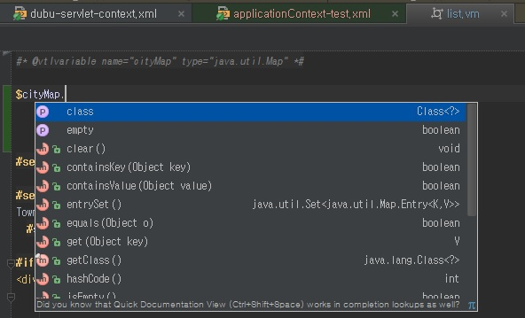

Intellij tip
================

intellij support velocity templet
-------------
velocity 에서 intellij 주석을 사용하면 code support를 받을 수 있다.
    #* @vtlvariable name="cityMap" type="java.util.Map" *#




remote debuging
------------------
### remote 서버설정
원격서버는 debug 설정 적용되어 운영 되고 있어야함
```
    -Xdebug -Xrunjdwp:transport=dt_socket,address=8000,server=y,suspend=n
```
### intellij설정
서버에서 remote server 선택.
server tab 은 무난하게 변경 www.주소.com  포트 80
startup/connection tab. Debug 선택. socket . port 8000

