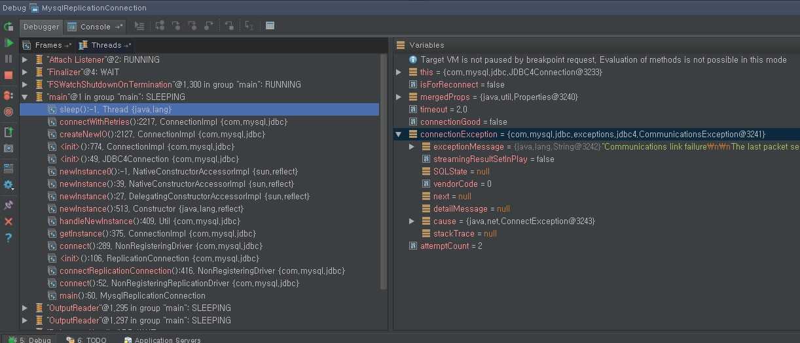
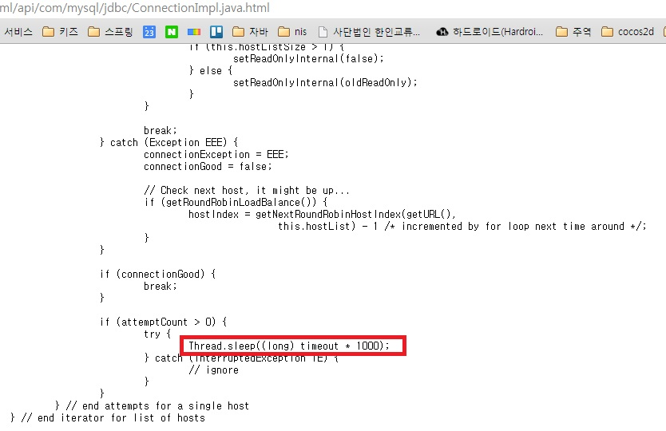

mysqlReplicationDriver
===============================

개요
------------
mysql ReplicationDriver 사용. master/slave 사용의 경우 master 장애시 connection 문제가 발생한다는데 실험을 통하여 알아본다.

방법
------------------

- mysql master/slave 구성
- 웹서비스를 구현하여 부하 발생
- master 장애발생을 가정하여 master 서버를 down 시킴.
- master db 복구
- 복구후에도 서비스 connection 에 문제 발생 여부 확인

master/slave 구성환경
------------------

master 1대 / slave 2대 구성
master01 ,slave01 ,slave02

db replicatoin 연결옵션
kidsGaia.jdbc.driver=com.mysql.jdbc.ReplicationDriver
kidsGaia.jdbc.url=jdbc:mysql:replication://master01:3306,master01:3306,slave01:3306,slave01:3306/dbname?autoReconnect=true&amp;useUnicode=true&amp;characterEncoding=utf8&amp;roundRobinLoadBalance=true
kidsGaia.jdbc.testOnBorrow=true
kidsGaia.jdbc.validationQuery=select 1
kidsGaia.jdbc.maxActive=4
kidsGaia.jdbc.maxWait=2 (milliseconds)
master/slave 연결 테스트

CASE1
------------------

- [master01],[master01,slave01,slave02]
- conn.setReadOnly(false)// master 연결
결과
conn master01
conn master01
conn master01
conn master01

CASE2
------------------

- [master01],[master01,slave01,slave02]
- conn.setReadOnly(true) // slave 연결
결과
conn master01
conn slave01
conn slave02
conn master01
conn master01
conn slave02
CASE3

- master01,[slave01,slave02]
- conn.setReadOnly(true) // slave 연결
결과
conn slave01
conn slave02
conn slave02
conn slave01
conn slave02

서버 Down 상황 TEST
------------------

CASE1
------------------

- [master01],[slave01,slave02]
- slave01 server down
- autoReconnect=true , maxWait=2(milliSecond)
- conn.setReadOnly(true) // slave 연결
결과
conn slave02
conn slave02
conn slave02
conn slave02
# 단 slave01 연결 시도시 행발생 약 5초 이상

CASE2
------------------
- master01,[slave01,slave02]
- slave01 server down (임의의포트로 변경)
- autoReconnect=false , maxWait=2(milliSecond)
- conn.setReadOnly(true) // slave 연결
결과
conn slave02
conn slave02
conn slave02
conn slave02
# 단 slave01 연결 시도시 행발생 없음

CASE3
------------------

- master01,[slave01,slave02]
- master01 server down.(임의의포트로 변경)
- autoReconnect=false , maxWait=2(milliSecond)
- conn.setReadOnly(false) // master 연결
결과
ConnectException 즉시발생

CASE4
------------------

- master01,[slave01,slave02]
- master01 server down(임의의포트로 변경)
- autoReconnect=true , maxWait=2(milliSecond)
- conn.setReadOnly(false) // master 연결
결과
```
3 times reconnect 시도로 행업 6초 이후 ConnectionException 발생
com.mysql.jdbc.exceptions.jdbc4.MySQLNonTransientConnectionException: Could not create connection to database server. Attempted reconnect 3 times. Giving up.
at sun.reflect.NativeConstructorAccessorImpl.newInstance0(Native Method)
at sun.reflect.NativeConstructorAccessorImpl.newInstance(NativeConstructorAccessorImpl.java:39)
at sun.reflect.DelegatingConstructorAccessorImpl.newInstance(DelegatingConstructorAccessorImpl.java:27)
at java.lang.reflect.Constructor.newInstance(Constructor.java:513)
```
결론.
autoReconnect=true 설정시 서버down 으로 connection fail 발생시 서비스의 행업 발생이 가능하다.

참고
------
- [취약점리포트](http://gywn.net/2012/07/mysql-replication-driver-error-report/)


