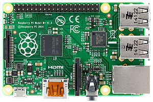

name: inverse
layout: true
---
class: title, center, middle

마법사의 지팡이
# Rasberry Pi

.footnote[
- [발표자](https://www.facebook.com/kozazz): 곽두환
]
---
class: middle, full-text

# 개요
- 컨셉 위키드.
- 동영상 수집. 주문부의 구현.
- 마법사의 소환, 헤리포터 마법사 모자 필요.
- blow 드라이기, 전부, 모터, 선풍기? 블로투스, 인터넷이믄 디게 멀리도 가능하다.
- spell 주문부  모바일로 짜면 쉽기는 하다.
- 노래 플레이.. ? 모바일 수신부? 전부 무엇으로 연결할꼬. 테터링?  테더링 반경은?
- 테더링을 통한 이터넷 혹은 블루투스 범위 제한거리는?

---
class: middle, full-text

# 참고 아이디어
- [헤리포터지팡이장난감](http://www.youtube.com/watch?v=thCDH83YiNA)
- [헤리포토 주문목록 위키](http://ko.wikipedia.org/wiki/%ED%95%B4%EB%A6%AC_%ED%8F%AC%ED%84%B0_%EC%8B%9C%EB%A6%AC%EC%A6%88%EC%9D%98_%EB%A7%88%EB%B2%95_%EB%AA%A9%EB%A1%9D)
- [ 헤리포터 주문 동영상](http://www.youtube.com/results?search_query=harry+potter+spells)

---

class: middle, full-text

감사합니다

